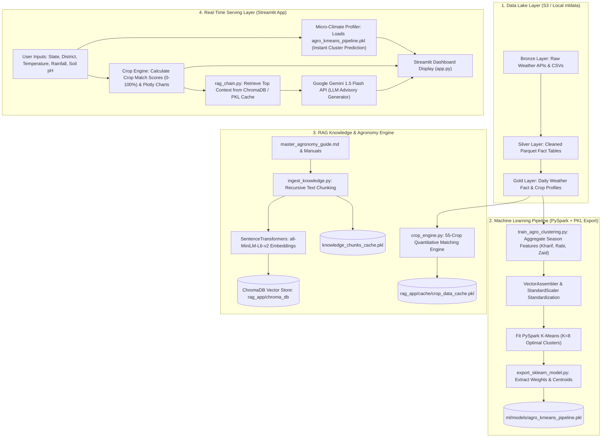

# AgroSense AI - Comprehensive Architecture & Data Flow Guide

This document provides a complete end-to-end breakdown of the **AgroSense AI Platform**, detailing the data engineering layer, PySpark ML clustering, local `.pkl` serialization, RAG vector ingestion with ChromaDB, and the Streamlit frontend serving application.

---

## 🌐 End-to-End System Data Flow Diagram



---

## 🔍 Detailed Component Breakdown

### 1. Data Lake Layer (`Bronze -> Silver -> Gold`)
- **Bronze**: Raw ingestion from weather APIs and state agricultural datasets.
- **Silver**: Data cleaning, schema enforcement, and deduplication into partitioned Apache Parquet tables (`s3://krishna-agro-silver/crop_data`).
- **Gold**: Business-level aggregations (`s3://krishna-agro-gold/daily_weather`) containing daily weather metrics, diurnal temperature ranges, and crop agronomic profiles.

---

### 2. Machine Learning Clustering Pipeline

* **Primary Script**: [`ml/train_agro_clustering.py`](file:///Users/krishnagawande/agro/ml/train_agro_clustering.py)
* **Exporter Script**: [`ml/export_sklearn_model.py`](file:///Users/krishnagawande/agro/ml/export_sklearn_model.py)

#### Workflow:
1. **PySpark Feature Extraction**: Reads daily weather data for 1,423+ cities across India and aggregates season-wise features (`kharif_temp`, `rabi_temp`, `zaid_temp`, `kharif_rainfall`, `rabi_rainfall`, `avg_humidity`, `temp_range`).
2. **Feature Scaling & Clustering**: Scales vectors using `StandardScaler` and fits an **Unsupervised K-Means Clustering model ($K=8$)**.
3. **Centroid Profiling**: Dynamically maps cluster centroids to 8 district-level Agro-Climatic Zones:
   - *Hot & Arid Desert Zone*
   - *Semi-Arid Central Plateau*
   - *Sub-Humid Indo-Gangetic Plains*
   - *Humid Eastern Delta*
   - *Western Coastal High-Rainfall Zone*
   - *Eastern Coromandel Coastal Zone*
   - *Himalayan Montane Zone*
   - *Deccan Rain-Shadow Dry Zone*
4. **Hybrid PKL Serialization**: Extracts PySpark centroid weights and scaling parameters, saving them into [`ml/models/agro_kmeans_pipeline.pkl`](file:///Users/krishnagawande/agro/ml/models/agro_kmeans_pipeline.pkl).
   - **Benefit**: Enables instant microsecond inference in web apps without starting a PySpark cluster.

---

### 3. Quantitative Crop Recommendation Engine

* **Script**: [`rag_app/crop_engine.py`](file:///Users/krishnagawande/agro/rag_app/crop_engine.py)

#### Workflow:
1. **ICAR 55-Crop Benchmark Scoring**: Evaluates crop suitability across temperature, rainfall, humidity, and soil pH dimensions using normalized Gaussian scoring:
   $$\text{Suitability Score} = w_{\text{temp}} S_{\text{temp}} + w_{\text{rain}} S_{\text{rain}} + w_{\text{hum}} S_{\text{hum}} + w_{\text{pH}} S_{\text{pH}}$$
2. **Local PKL Cache Layer**: Caches dataset records to [`rag_app/cache/crop_data_cache.pkl`](file:///Users/krishnagawande/agro/rag_app/cache/crop_data_cache.pkl) to bypass S3 round-trips on app startup.

---

### 4. RAG Agronomy Knowledge & Advisory Engine

* **Ingestion Script**: [`rag_app/ingest_knowledge.py`](file:///Users/krishnagawande/agro/rag_app/ingest_knowledge.py)
* **Chain Script**: [`rag_app/rag_chain.py`](file:///Users/krishnagawande/agro/rag_app/rag_chain.py)

#### Workflow:
1. **Document Ingestion & Chunking**: Reads agronomy guidebooks from `rag_app/knowledge_base/` and splits text into 600-character overlapping chunks via `RecursiveCharacterTextSplitter`.
2. **Vector Embeddings**: Computes 384-dimensional vector embeddings using `sentence-transformers/all-MiniLM-L6-v2` and persists them into **ChromaDB** (`rag_app/chroma_db`) and [`rag_app/cache/knowledge_chunks_cache.pkl`](file:///Users/krishnagawande/agro/rag_app/cache/knowledge_chunks_cache.pkl).
3. **Retrieval-Augmented Advisory Generation**:
   - Queries ChromaDB with dynamic micro-climate tags (e.g., *"Wheat cultivation heat stress drought tolerance acidic soil"*).
   - Retrieves relevant ICAR guide context.
   - Prompts **Google Gemini 1.5 Flash API** to generate structured, actionable farming advisories.

---

### 5. Streamlit Frontend Serving Layer

* **Script**: [`app.py`](file:///Users/krishnagawande/agro/app.py)

#### UI Deck & Features:
- **Micro-Climate Profiler**: Uses `agro_kmeans_pipeline.pkl` to classify user inputs into Agro-Climatic Zones in real-time.
- **Plotly Visual Analytics**: Renders radar charts and suitability score breakdown bars for 55 crops.
- **AI Agronomist RAG Advisory**: Displays context-augmented LLM recommendations.
- **State Soil & Climate Explorer**: Provides interactive exploration of soil NPK levels and weather trends across Indian states.

---

## 🚀 How to Execute the Entire Pipeline

```bash
# 1. Train ML K-Means Model & Export Local PKL Artifact
python3 ml/train_agro_clustering.py --k-clusters 8

# 2. Build RAG Vector Database & Chunk Cache
python3 rag_app/ingest_knowledge.py

# 3. Launch Streamlit Web Application
streamlit run app.py
```
