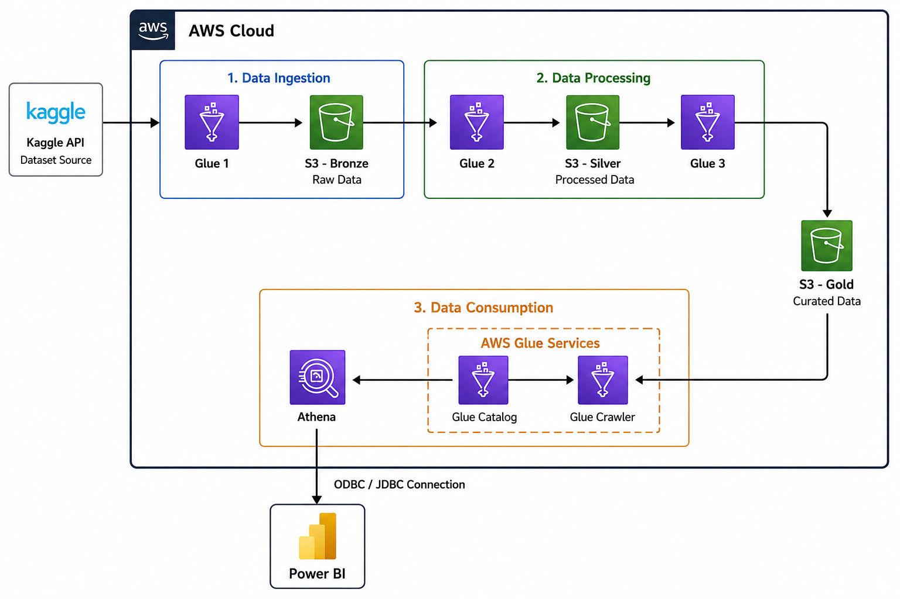

# 🌦️ India Weather Intelligence Platform

A cloud-native weather analytics platform that transforms large-scale historical weather data into actionable insights for **agriculture** and **renewable energy planning** using AWS, Apache Spark, Athena, and Power BI.

---

## Overview

The India Weather Intelligence Platform is a Big Data analytics solution designed to process historical weather observations from thousands of Indian cities and convert them into business-ready insights.

The platform supports:

- 🌾 Weather-driven agricultural planning
- ⚡ Renewable energy resource assessment
- 🌧️ Season arrival detection
- 📊 Regional rainfall pattern analysis
- 📈 Interactive business intelligence dashboards

---

## Problem Statement

Weather conditions directly influence agricultural productivity and renewable energy generation. However, traditional planning often relies on fixed calendars or fragmented weather information rather than actual environmental conditions.

This project addresses two major challenges:

### Agriculture
- Detect the actual arrival of seasons using rainfall, humidity, temperature, and atmospheric pressure.
- Identify regions experiencing similar rainfall behaviour to support agricultural planning and resource allocation.

### Renewable Energy
- Analyse long-term weather patterns to support solar and wind energy assessment.
- Provide historical insights on solar radiation indicators (cloud cover), wind speed, temperature, and atmospheric conditions for renewable energy planning.

---

## Dataset

**Source:** Indian 5000 Cities Weather Dataset (Kaggle)

The dataset contains historical weather observations collected across thousands of Indian cities, including:

- Temperature
- Humidity
- Rainfall
- Atmospheric Pressure
- Wind Speed
- Wind Direction
- Cloud Cover
- Dew Point
- Snowfall
- Date & Time
- City

---

# Architecture

<p align="center">
  
</p>

### Data Pipeline

```
Kaggle Dataset
       │
       ▼
Amazon EC2
       │
       ▼
Amazon S3 (Data Lake)
       │
       ▼
AWS Glue ETL + Apache Spark
       │
       ▼
Parquet (Optimized Data)
       │
       ▼
Glue Crawler
       │
       ▼
Glue Data Catalog
       │
       ▼
Amazon Athena
       │
       ▼
Power BI Dashboards
```

---

# Technology Stack

| Category | Technologies |
|----------|--------------|
| Cloud | AWS EC2, Amazon S3, AWS Glue, Athena, IAM, CloudWatch |
| Big Data | Apache Spark, PySpark, Databricks |
| Storage | Parquet |
| Analytics | SQL, Python |
| Visualization | Power BI |

---

# Key Features

- Large-scale weather data processing
- Distributed ETL pipeline using Apache Spark
- Cloud-based data lake architecture
- Optimized Parquet storage
- Serverless querying using Amazon Athena
- Interactive Power BI dashboards
- Historical weather trend analysis
- Region-wise rainfall comparison
- Season arrival detection

---

# Dashboards

### Weather & Season Intelligence
- Season Arrival Detection
- Rainfall & Temperature Trends
- Weather Summary
- Seasonal Transition Analysis

### Regional Rainfall Intelligence
- Rainfall Correlation
- Regional Rainfall Comparison
- Rainfall Synchronization Analysis
- Rainfall Anomaly Detection

### Weather Trends & Decision Support
- Temperature Trends
- Wind Analysis
- Pressure Trends
- Cloud Cover Analysis
- Dry Spell Monitoring

---

# Future Enhancements

- Machine Learning-based Weather Prediction
- Rainfall Forecasting
- Climate Clustering
- Crop Recommendation System
- Renewable Energy Potential Prediction
- Real-Time Weather Data Integration

---

## License

This project is developed for educational and research purposes.
